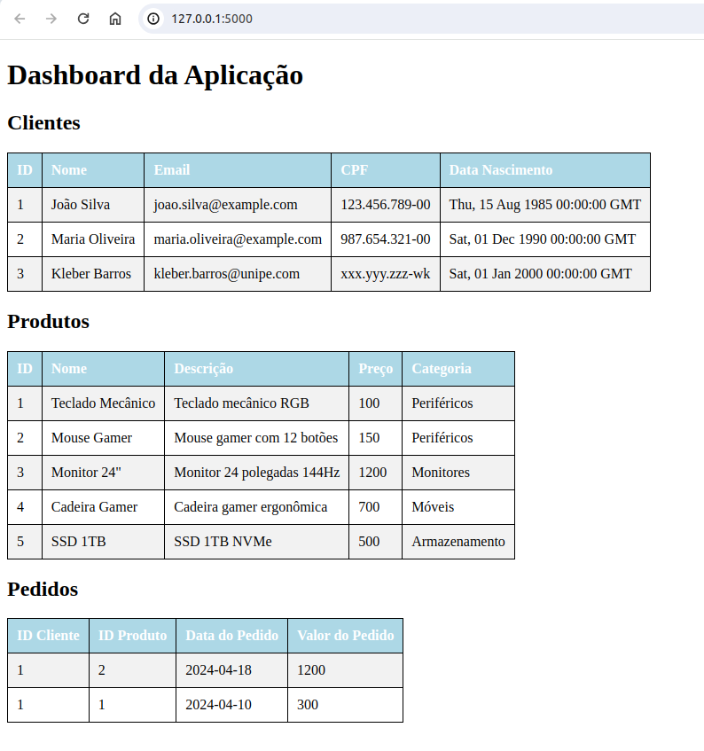

# Integração SQL - NoSQL com Flask

## Setup

- Baixe o projeto
- Crie um banco de dados no mysql chamado posweb_db
- Crie e popule as tabelas de cliente e de produto

### Exemplo de código:

```sql
-- Cria o banco de dados
CREATE DATABASE IF NOT EXISTS posweb_db;
USE posweb_db;

-- Cria a tabela de clientes
CREATE TABLE IF NOT EXISTS clientes (
    id_cliente INT AUTO_INCREMENT,
    nome VARCHAR(255) NOT NULL,
    email VARCHAR(255) NOT NULL,
    cpf VARCHAR(15) NOT NULL,
    data_nascimento DATE NOT NULL,
    PRIMARY KEY (id_cliente)
);

-- Cria a tabela de produtos
CREATE TABLE IF NOT EXISTS produtos (
    id_produto INT AUTO_INCREMENT,
    nome VARCHAR(255) NOT NULL,
    descricao TEXT,
    preco DECIMAL(10, 2) NOT NULL,
    categoria VARCHAR(255) NOT NULL,
    PRIMARY KEY (id_produto)
);

-- Insere dados na tabela de clientes
INSERT INTO clientes (nome, email, cpf, data_nascimento) VALUES
('João Silva', 'joao.silva@example.com', '123.456.789-00', '1985-08-15'),
('Maria Oliveira', 'maria.oliveira@example.com', '987.654.321-00', '1990-12-01'),
('Kleber Barros', 'kleber.barros@unipe.com', 'xxx.yyy.zzz-wk', '2000-01-01');

-- Insere dados na tabela de produtos
INSERT INTO produtos (nome, descricao, preco, categoria) VALUES
('Teclado Mecânico', 'Teclado mecânico RGB', 100.00, 'Periféricos'),
('Mouse Gamer', 'Mouse gamer com 12 botões', 150.00, 'Periféricos'),
('Monitor 24"', 'Monitor 24 polegadas 144Hz', 1200.00, 'Monitores'),
('Cadeira Gamer', 'Cadeira gamer ergonômica', 700.00, 'Móveis'),
('SSD 1TB', 'SSD 1TB NVMe', 500.00, 'Armazenamento');
```

- Crie uma base de dados no mongodb compass

### Exemplo de código:

```sql
// Conecta ao banco de dados `banco_web`. Se não existir, será criado ao inserir os primeiros documentos.
use banco_web

// Cria a coleção 'pedidos' e insere os documentos
db.pedidos.insertMany([
  {
    "data_pedido": "2024-04-18",
    "id_cliente": 1,
    "id_produto": 2,
    "valor_pedido": 1200
  },
  {
    "data_pedido": "2024-04-10",
    "id_cliente": 1,
    "id_produto": 1,
    "valor_pedido": 300.0
  }
])
``````


## Após rodar o código main.py (preferencialmente no pycharm), as seguintes rotas são possíveis:


### Visualização do dashboad

- Contem as tabelas clientes, produtos e pedidos 
- Toda vez que inserir, modificar ou deletar algum elemento na tabela, será atualizado no banco de dados e do ***dashboard*** também

```html
http://127.0.0.1:5000/
```





### Rota GET de produtos
```html
http://127.0.0.1:5000/produtos
```

### Rota POST de produtos
- usar o postmam para introduzir dado com o método POST (body - raw)

```html
http://127.0.0.1:5000/produtos
```


```html
{
    "categoria": "Periféricos",
    "descricao": "Caixa de som multilaser",
    "id": 1,
    "nome": "Caixa de som",
    "preco": 1500.0
  }
```

### Rota PUT de produtos
- usar o postmam para modificar dado com o método PUT (body - raw)

Exemplo:
```html
http://127.0.0.1:5000/produtos/6
```

```html
{
    "categoria": "Periféricos",
    "descricao": "Caixa de som multilaser",
    "id": 1,
    "nome": "Caixa de som",
    "preco": 150.0
  }
```


### Rota DELETE de produtos
- usar o postmam para delatar dado com o método DELETE 

Exemplo:
```html
http://127.0.0.1:5000/produtos/6
```


### Rota GET de clientes
```html
http://127.0.0.1:5000/clientes
```

### Rota POST de clientes
- usar o postmam para introduzir dado com o método POST (body - raw)

```html
http://127.0.0.1:5000/clientes
```


```html
{
    "nome": "Khalel Barros",
    "email": "khalel.barros@unipe.com",
    "cpf": "xxx.yyy.zz5-wk",
    "data_nascimento": "2000-01-01"
}
```

### Rota PUT de cliente
- usar o postmam para modificar dado com o método PUT (body - raw)

Exemplo:
```html
http://127.0.0.1:5000/cliente/5
```

```html
{
    "nome": "Khalel Barros",
    "email": "khalel.barros@unipe.com",
    "cpf": "111.222.333-44",
    "data_nascimento": "2009-07-21"
}
```


### Rota DELETE de cliente
- usar o postmam para delatar dado com o método DELETE 

Exemplo:
```html
http://127.0.0.1:5000/cliente/5
```


### Rota GET de pedido
```html
http://127.0.0.1:5000/pedidos
```

### Rota POST de pedidos
- usar o postmam para introduzir dado com o método POST (body - raw)

```html
http://127.0.0.1:5000/pedidos
```


```html
{
  "id_produto": 4,
  "id_cliente": 3,
  "data_pedido": "2024-04-10",
  "valor_pedido": 1400.00
}

```

### Rota PUT de pedido
- usar o postmam para modificar dado com o método PUT (body - raw)

Exemplo:
```html
http://127.0.0.1:5000/pedidos/<hash_pedido>
```

```html
{
  "id_produto": 4,
  "id_cliente": 3,
  "data_pedido": "2024-04-18",
  "valor_pedido": 2100.00
}
```


### Rota DELETE de pedido
- usar o postmam para delatar dado com o método DELETE 

Exemplo:
```html
http://127.0.0.1:5000/pedidos/<hash_pedido>
```
